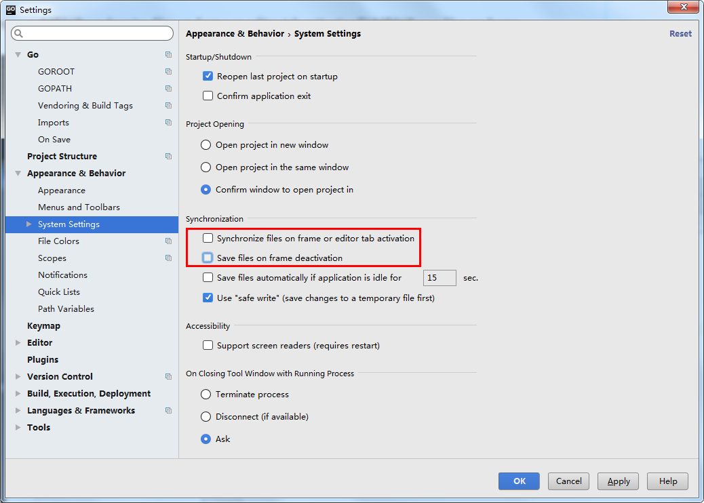
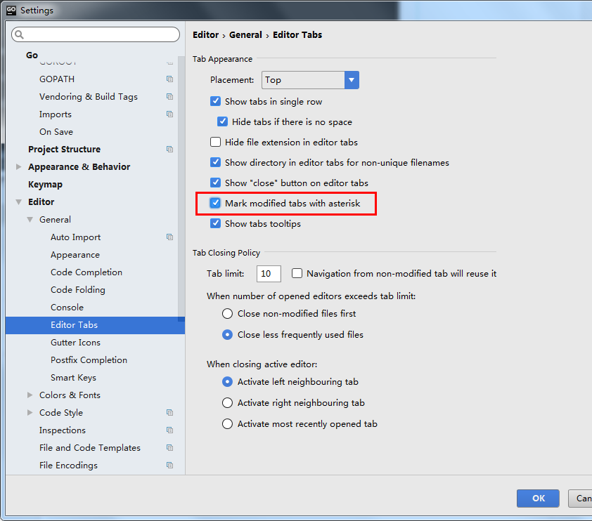
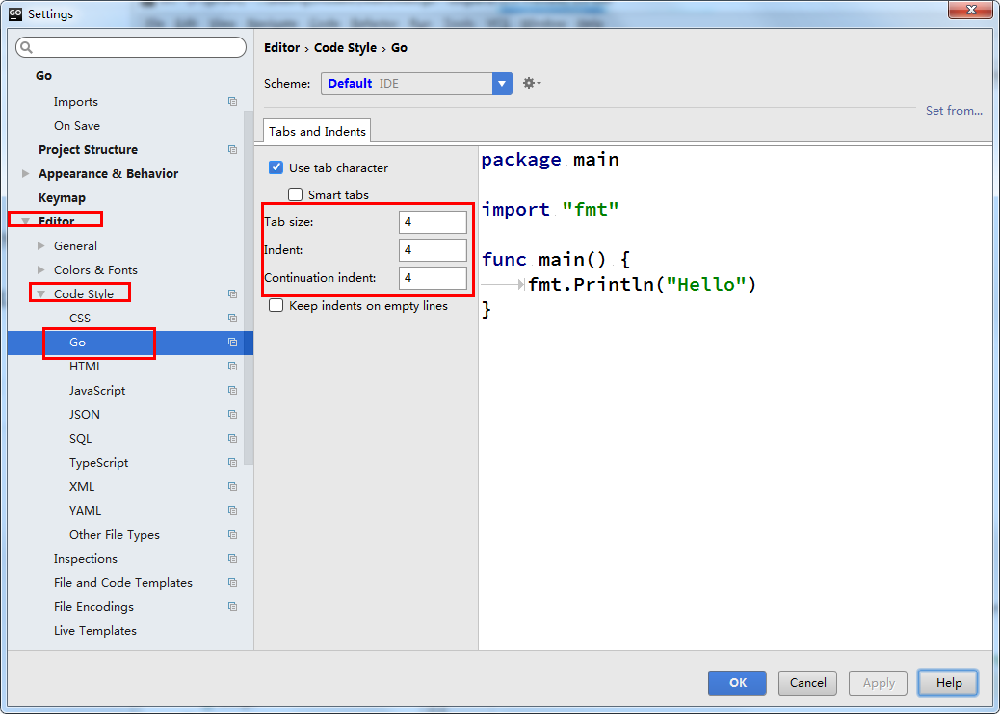

## Jetbrains使用手册

### 配置修改

1. 取消自动保存

   File->Settings->Appearance&Behavior->System Settings中按照如下去掉两个勾勾

   

2. 和修改后未保存文件为*号提示

   File—->Settings—–>Editor—->General—->Editor tabs—->勾选 mark modified files as asterisk

   

3. 设置缩进大小

   

